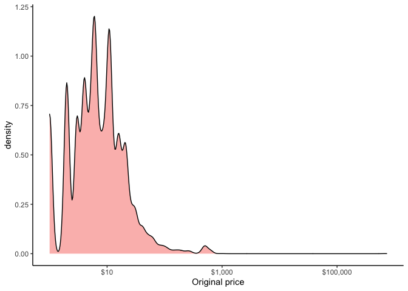
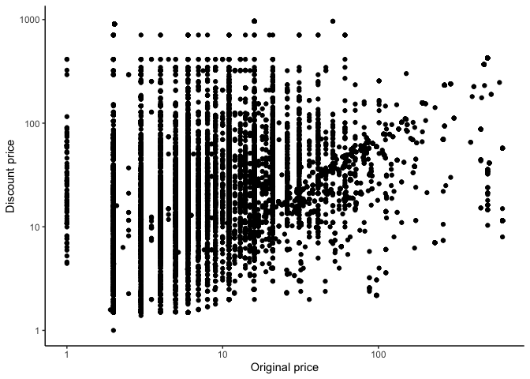

Mini Data-Analysis Deliverable 1
================

*Student: Erick Isaac Navarro Delgado*

# Welcome to your (maybe) first-ever data analysis project!

And hopefully the first of many. Let's get started:

1.  Install the [`datateachr`](https://github.com/UBC-MDS/datateachr) package by typing the following into your **R terminal**:

2.  Load the packages below.

``` r
library(datateachr)
library(tidyverse)
library(knitr)
library(scales)
```

1.  Make a repository in the <https://github.com/stat545ubc-2021> Organization. You will be working with this repository for the entire data analysis project. You can either make it public, or make it private and add the TA's and Vincenzo as collaborators.
    -   UPDATE: There is now a link that will help you make a repo. It's [on canvas](https://canvas.ubc.ca/courses/80816/pages/mini-data-analysis-create-a-repository) (and on a Slack announcement).
2.  When you go to submit, submit a URL to your repository to canvas.

# Instructions

More details regarding the instructions and points allocated to each task can be found below. Briefly,

-   Each milestone is worth 30 points. The number of points allocated to each task will be annotated within each deliverable. Tasks that are more challenging will often be allocated more points.

-   10 points will be allocated to the reproducibility, cleanliness, and coherence of the analysis. While the three milestones will be submitted as independent deliverables, the analysis itself is a continuum - think of it as 3 chapters to a story. Each chapter, or in this case, portion of your analysis, should be easily followed through by someone unfamiliar with the content. [Here](https://swcarpentry.github.io/r-novice-inflammation/06-best-practices-R/) is a good resource for what constitutes "good code". Learning good coding practices early in your career will save you hassle later on!

# Learning Objectives

By the end of this milestone, you should:

-   Become familiar with your dataset of choosing
-   Think of 4 questions that you would like to answer with your data
-   Generate a reproducible and clear report using R Markdown

# Task 1: Choose your favorite dataset (10 points)

The `datateachr` package by Hayley Boyce and Jordan Bourak currently composed of 7 semi-tidy datasets for educational purposes. Here is a brief description of each dataset:

-   *apt\_buildings*: Acquired courtesy of The City of Toronto’s Open Data Portal. It currently has 3455 rows and 37 columns.

-   *building\_permits*: Acquired courtesy of The City of Vancouver’s Open Data Portal. It currently has 20680 rows and 14 columns.

-   *cancer\_sample*: Acquired courtesy of UCI Machine Learning Repository. It currently has 569 rows and 32 columns.

-   *flow\_sample*: Acquired courtesy of The Government of Canada’s Historical Hydrometric Database. It currently has 218 rows and 7 columns.

-   *parking\_meters*: Acquired courtesy of The City of Vancouver’s Open Data Portal. It currently has 10032 rows and 22 columns.

-   *steam\_games*: Acquired courtesy of Kaggle. It currently has 40833 rows and 21 columns.

-   *vancouver\_trees*: Acquired courtesy of The City of Vancouver’s Open Data Portal. It currently has 146611 rows and 20 columns.

**Things to keep in mind**

-   We hope that this project will serve as practice for carrying our your own *independent* data analysis. Remember to comment your code, be explicit about what you are doing, and write notes in this markdown document when you feel that context is required. As you advance in the project, prompts and hints to do this will be diminished - it'll be up to you!

-   Before choosing a dataset, you should always keep in mind **your goal**, or in other ways, *what you wish to achieve with this data*. This mini data-analysis project focuses on *data wrangling*, *tidying*, and *visualization*. In short, it's a way for you to get your feet wet with exploring data on your own.

And that is exactly the first thing that you will do!

## Choosing four interesting datasets

1.1 Out of the 7 datasets available in the `datateachr` package, choose **4** that appeal to you based on their description. Write your choices below:

> **1: steam\_games**

> **2: cancer\_sample**

> **3: vancouver\_trees**

> **4: flow\_sample**

## Exploring the chosen datasets

1.2 One way to narrowing down your selection is to *explore* the datasets. Use your knowledge of dplyr to find out at least *3* attributes about each of these datasets (an attribute is something such as number of rows, variables, class type...). The goal here is to have an idea of *what the data looks like*.

*Hint:* This is one of those times when you should think about the cleanliness of your analysis. I added a single code chunk for you, but do you want to use more than one? Would you like to write more comments outside of the code chunk?

### steam\_games

``` r
# Explore the dimensions, names of each column and its data type
glimpse(steam_games)
```

    ## Rows: 40,833
    ## Columns: 21
    ## $ id                       <dbl> 1, 2, 3, 4, 5, 6, 7, 8, 9, 10, 11, 12, 13, 14…
    ## $ url                      <chr> "https://store.steampowered.com/app/379720/DO…
    ## $ types                    <chr> "app", "app", "app", "app", "app", "bundle", …
    ## $ name                     <chr> "DOOM", "PLAYERUNKNOWN'S BATTLEGROUNDS", "BAT…
    ## $ desc_snippet             <chr> "Now includes all three premium DLC packs (Un…
    ## $ recent_reviews           <chr> "Very Positive,(554),- 89% of the 554 user re…
    ## $ all_reviews              <chr> "Very Positive,(42,550),- 92% of the 42,550 u…
    ## $ release_date             <chr> "May 12, 2016", "Dec 21, 2017", "Apr 24, 2018…
    ## $ developer                <chr> "id Software", "PUBG Corporation", "Harebrain…
    ## $ publisher                <chr> "Bethesda Softworks,Bethesda Softworks", "PUB…
    ## $ popular_tags             <chr> "FPS,Gore,Action,Demons,Shooter,First-Person,…
    ## $ game_details             <chr> "Single-player,Multi-player,Co-op,Steam Achie…
    ## $ languages                <chr> "English,French,Italian,German,Spanish - Spai…
    ## $ achievements             <dbl> 54, 37, 128, NA, NA, NA, 51, 55, 34, 43, 72, …
    ## $ genre                    <chr> "Action", "Action,Adventure,Massively Multipl…
    ## $ game_description         <chr> "About This Game Developed by id software, th…
    ## $ mature_content           <chr> NA, "Mature Content Description  The develope…
    ## $ minimum_requirements     <chr> "Minimum:,OS:,Windows 7/8.1/10 (64-bit versio…
    ## $ recommended_requirements <chr> "Recommended:,OS:,Windows 7/8.1/10 (64-bit ve…
    ## $ original_price           <dbl> 19.99, 29.99, 39.99, 44.99, 0.00, NA, 59.99, …
    ## $ discount_price           <dbl> 14.99, NA, NA, NA, NA, 35.18, 70.42, 17.58, N…

### cancer\_sample

``` r
# Explore the dimensions, names of each column and its data type
glimpse(cancer_sample)
```

    ## Rows: 569
    ## Columns: 32
    ## $ ID                      <dbl> 842302, 842517, 84300903, 84348301, 84358402, …
    ## $ diagnosis               <chr> "M", "M", "M", "M", "M", "M", "M", "M", "M", "…
    ## $ radius_mean             <dbl> 17.990, 20.570, 19.690, 11.420, 20.290, 12.450…
    ## $ texture_mean            <dbl> 10.38, 17.77, 21.25, 20.38, 14.34, 15.70, 19.9…
    ## $ perimeter_mean          <dbl> 122.80, 132.90, 130.00, 77.58, 135.10, 82.57, …
    ## $ area_mean               <dbl> 1001.0, 1326.0, 1203.0, 386.1, 1297.0, 477.1, …
    ## $ smoothness_mean         <dbl> 0.11840, 0.08474, 0.10960, 0.14250, 0.10030, 0…
    ## $ compactness_mean        <dbl> 0.27760, 0.07864, 0.15990, 0.28390, 0.13280, 0…
    ## $ concavity_mean          <dbl> 0.30010, 0.08690, 0.19740, 0.24140, 0.19800, 0…
    ## $ concave_points_mean     <dbl> 0.14710, 0.07017, 0.12790, 0.10520, 0.10430, 0…
    ## $ symmetry_mean           <dbl> 0.2419, 0.1812, 0.2069, 0.2597, 0.1809, 0.2087…
    ## $ fractal_dimension_mean  <dbl> 0.07871, 0.05667, 0.05999, 0.09744, 0.05883, 0…
    ## $ radius_se               <dbl> 1.0950, 0.5435, 0.7456, 0.4956, 0.7572, 0.3345…
    ## $ texture_se              <dbl> 0.9053, 0.7339, 0.7869, 1.1560, 0.7813, 0.8902…
    ## $ perimeter_se            <dbl> 8.589, 3.398, 4.585, 3.445, 5.438, 2.217, 3.18…
    ## $ area_se                 <dbl> 153.40, 74.08, 94.03, 27.23, 94.44, 27.19, 53.…
    ## $ smoothness_se           <dbl> 0.006399, 0.005225, 0.006150, 0.009110, 0.0114…
    ## $ compactness_se          <dbl> 0.049040, 0.013080, 0.040060, 0.074580, 0.0246…
    ## $ concavity_se            <dbl> 0.05373, 0.01860, 0.03832, 0.05661, 0.05688, 0…
    ## $ concave_points_se       <dbl> 0.015870, 0.013400, 0.020580, 0.018670, 0.0188…
    ## $ symmetry_se             <dbl> 0.03003, 0.01389, 0.02250, 0.05963, 0.01756, 0…
    ## $ fractal_dimension_se    <dbl> 0.006193, 0.003532, 0.004571, 0.009208, 0.0051…
    ## $ radius_worst            <dbl> 25.38, 24.99, 23.57, 14.91, 22.54, 15.47, 22.8…
    ## $ texture_worst           <dbl> 17.33, 23.41, 25.53, 26.50, 16.67, 23.75, 27.6…
    ## $ perimeter_worst         <dbl> 184.60, 158.80, 152.50, 98.87, 152.20, 103.40,…
    ## $ area_worst              <dbl> 2019.0, 1956.0, 1709.0, 567.7, 1575.0, 741.6, …
    ## $ smoothness_worst        <dbl> 0.1622, 0.1238, 0.1444, 0.2098, 0.1374, 0.1791…
    ## $ compactness_worst       <dbl> 0.6656, 0.1866, 0.4245, 0.8663, 0.2050, 0.5249…
    ## $ concavity_worst         <dbl> 0.71190, 0.24160, 0.45040, 0.68690, 0.40000, 0…
    ## $ concave_points_worst    <dbl> 0.26540, 0.18600, 0.24300, 0.25750, 0.16250, 0…
    ## $ symmetry_worst          <dbl> 0.4601, 0.2750, 0.3613, 0.6638, 0.2364, 0.3985…
    ## $ fractal_dimension_worst <dbl> 0.11890, 0.08902, 0.08758, 0.17300, 0.07678, 0…

### vancouver\_trees

``` r
# Explore the dimensions, names of each column and its data type
glimpse(vancouver_trees)
```

    ## Rows: 146,611
    ## Columns: 20
    ## $ tree_id            <dbl> 149556, 149563, 149579, 149590, 149604, 149616, 149…
    ## $ civic_number       <dbl> 494, 450, 4994, 858, 5032, 585, 4909, 4925, 4969, 7…
    ## $ std_street         <chr> "W 58TH AV", "W 58TH AV", "WINDSOR ST", "E 39TH AV"…
    ## $ genus_name         <chr> "ULMUS", "ZELKOVA", "STYRAX", "FRAXINUS", "ACER", "…
    ## $ species_name       <chr> "AMERICANA", "SERRATA", "JAPONICA", "AMERICANA", "C…
    ## $ cultivar_name      <chr> "BRANDON", NA, NA, "AUTUMN APPLAUSE", NA, "CHANTICL…
    ## $ common_name        <chr> "BRANDON ELM", "JAPANESE ZELKOVA", "JAPANESE SNOWBE…
    ## $ assigned           <chr> "N", "N", "N", "Y", "N", "N", "N", "N", "N", "N", "…
    ## $ root_barrier       <chr> "N", "N", "N", "N", "N", "N", "N", "N", "N", "N", "…
    ## $ plant_area         <chr> "N", "N", "4", "4", "4", "B", "6", "6", "3", "3", "…
    ## $ on_street_block    <dbl> 400, 400, 4900, 800, 5000, 500, 4900, 4900, 4900, 7…
    ## $ on_street          <chr> "W 58TH AV", "W 58TH AV", "WINDSOR ST", "E 39TH AV"…
    ## $ neighbourhood_name <chr> "MARPOLE", "MARPOLE", "KENSINGTON-CEDAR COTTAGE", "…
    ## $ street_side_name   <chr> "EVEN", "EVEN", "EVEN", "EVEN", "EVEN", "ODD", "ODD…
    ## $ height_range_id    <dbl> 2, 4, 3, 4, 2, 2, 3, 3, 2, 2, 2, 5, 3, 2, 2, 2, 2, …
    ## $ diameter           <dbl> 10.00, 10.00, 4.00, 18.00, 9.00, 5.00, 15.00, 14.00…
    ## $ curb               <chr> "N", "N", "Y", "Y", "Y", "Y", "Y", "Y", "Y", "Y", "…
    ## $ date_planted       <date> 1999-01-13, 1996-05-31, 1993-11-22, 1996-04-29, 19…
    ## $ longitude          <dbl> -123.1161, -123.1147, -123.0846, -123.0870, -123.08…
    ## $ latitude           <dbl> 49.21776, 49.21776, 49.23938, 49.23469, 49.23894, 4…

### flow\_sample

``` r
# Explore the dimensions, names of each column and its data type
glimpse(flow_sample)
```

    ## Rows: 218
    ## Columns: 7
    ## $ station_id   <chr> "05BB001", "05BB001", "05BB001", "05BB001", "05BB001", "0…
    ## $ year         <dbl> 1909, 1910, 1911, 1912, 1913, 1914, 1915, 1916, 1917, 191…
    ## $ extreme_type <chr> "maximum", "maximum", "maximum", "maximum", "maximum", "m…
    ## $ month        <dbl> 7, 6, 6, 8, 6, 6, 6, 6, 6, 6, 6, 7, 6, 6, 6, 7, 5, 7, 6, …
    ## $ day          <dbl> 7, 12, 14, 25, 11, 18, 27, 20, 17, 15, 22, 3, 9, 5, 14, 5…
    ## $ flow         <dbl> 314, 230, 264, 174, 232, 214, 236, 309, 174, 345, 185, 24…
    ## $ sym          <chr> NA, NA, NA, NA, NA, NA, NA, NA, NA, NA, NA, NA, NA, NA, N…

## Narrowing it down to 2

1.3 Now that you've explored the 4 datasets that you were initially most interested in, let's narrow it down to 2. What lead you to choose these 2? Briefly explain your choices below, and feel free to include any code in your explanation.

> I decided to narrow it down to the **vancouver\_trees** and **steam\_games** datasets. because they have a bigger number of samples, which might be more useful for answering a wide range of questions without having any issue with lack of samples (*Table 1*).
> Furthermore, both datasets have a big number of columns, which is useful for asking several questions by having a lot of variables to compare and analyze (*Table 1*). It is worth mentioning that, even though the cancer\_sample has the highest number of columns, they are not very descriptive by themselves, as it can be observed in the section above. Whithout a proper metadata file, it is hard to know what is the meaning of some key variables such as diagnosis, or the suffix "\_worst". On the other hand, the column names of the chosen datasets are interesting and self descriptive.

``` r
#Code chunk for creating Table 1
data.frame(rbind(dim(vancouver_trees),  # Create a data frame with the dimensions of each dataset as variables
                 dim(steam_games),
                 dim(cancer_sample),
                 dim(flow_sample)),
           row.names = c("vancouver_trees", #Add the names of the datasets
                         "steam_games", 
                         "cancer_sample", 
                         "flow_sample")) %>%
  knitr::kable(format = "markdown", col.names = c("Sample_size", "Number_of_variables"),
        caption = "Table 1. Dimensions of the four datasets") #Print the table and add an informative name to the columns
```

|                  |  Sample\_size|  Number\_of\_variables|
|:-----------------|-------------:|----------------------:|
| vancouver\_trees |        146611|                     20|
| steam\_games     |         40833|                     21|
| cancer\_sample   |           569|                     32|
| flow\_sample     |           218|                      7|

## Final decision

1.4 Time for the final decision! Going back to the beginning, it's important to have an *end goal* in mind. For example, if I had chosen the `titanic` dataset for my project, I might've wanted to explore the relationship between survival and other variables. Try to think of 1 research question that you would want to answer with each dataset. Note them down below, and make your final choice based on what seems more interesting to you!

> **vancouver\_trees**: Which species has the tallest trees?

> **steam\_games**: What is the average discount price in videogames?

# Important note

Read Tasks 2 and 3 *fully* before starting to complete either of them. Probably also a good point to grab a coffee to get ready for the fun part!

This project is semi-guided, but meant to be *independent*. For this reason, you will complete tasks 2 and 3 below (under the **START HERE** mark) as if you were writing your own exploratory data analysis report, and this guidance never existed! Feel free to add a brief introduction section to your project, format the document with markdown syntax as you deem appropriate, and structure the analysis as you deem appropriate. Remember, marks will be awarded for completion of the 4 tasks, but 10 points of the whole project are allocated to a reproducible and clean analysis. If you feel lost, you can find a sample data analysis [here](https://www.kaggle.com/headsortails/tidy-titarnic) to have a better idea. However, bear in mind that it is **just an example** and you will not be required to have that level of complexity in your project.

# Task 2: Exploring your dataset (15 points)

If we rewind and go back to the learning objectives, you'll see that by the end of this deliverable, you should have formulated *4* research questions about your data that you may want to answer during your project. However, it may be handy to do some more exploration on your dataset of choice before creating these questions - by looking at the data, you may get more ideas. **Before you start this task, read all instructions carefully until you reach START HERE**.

2.1 Complete *4 out of the following 8 exercises* to dive deeper into your data. All datasets are different and therefore, not all of these tasks may make sense for your data - which is why you should only answer *4*. Use *dplyr* and *ggplot*.

1.  Plot the distribution of a numeric variable.
2.  Create a new variable based on other variables in your data (only if it makes sense)
3.  Investigate how many missing values there are per variable. Can you find a way to plot this?
4.  Explore the relationship between 2 variables in a plot.
5.  Filter observations in your data according to your own criteria. Think of what you'd like to explore - again, if this was the `titanic` dataset, I may want to narrow my search down to passengers born in a particular year...
6.  Use a boxplot to look at the frequency of different observations within a single variable. You can do this for more than one variable if you wish!
7.  Make a new tibble with a subset of your data, with variables and observations that you are interested in exploring.
8.  Use a density plot to explore any of your variables (that are suitable for this type of plot).

2.2 For each of the 4 exercises that you complete, provide a *brief explanation* of why you chose that exercise in relation to your data (in other words, why does it make sense to do that?), and sufficient comments for a reader to understand your reasoning and code.

## Introduction

[Steam](https://store.steampowered.com/games/) is a gaming plataform that contains more than 30,000 games for a wide variety of devices. Besides selling and storing videogames, this plataform is an online meeting point for gamers, offering streaming services and a chat to promote the interaction betweenn players. With over 100 million users, Steam is one of the most popular in its kind.

In this milestone, I will explore the **steam\_games** dataset from the `datateachr` package, which has information of almost 41,000 videogames, in order to define 4 potential research questions that could be answered with this dataset. This exploration consisted in ...

## Exercise 1: Plotting the distribution of the original price of the games

As a first exploration, I decided to plot the distribution of the price of the games, to get a first look of how much they cost.

``` r
#Code chunk for plotting the distribution of the original_price variable in steam_games
#
steam_games %>% 
  filter(!is.na(original_price)) %>% #Remove NAs
  mutate(original_price = original_price +1) %>% #Add 1 to the price because some values are 0, which makes makes the log be infinite
  ggplot(aes(original_price))+
  scale_x_log10(labels = scales::dollar_format()) + #Set a logarithmic scale to the prices because the variaition is very big
  geom_density(aes(fill = ""), alpha = 0.5) + #Add the geom_density with color inside
  guides(fill = "none")+ #Remove the fill legend, which has no meaning
  xlab("Original price") + 
  theme_classic()
```



## Exercise 2: Create a new column that has exclusively the overall review category

I also noticed that the `all_reviews` variable has a lot of information besides the actual overall review, as you can see here:

``` r
head(steam_games$all_reviews)
```

    ## [1] "Very Positive,(42,550),- 92% of the 42,550 user reviews for this game are positive."  
    ## [2] "Mixed,(836,608),- 49% of the 836,608 user reviews for this game are positive."        
    ## [3] "Mostly Positive,(7,030),- 71% of the 7,030 user reviews for this game are positive."  
    ## [4] "Mixed,(167,115),- 61% of the 167,115 user reviews for this game are positive."        
    ## [5] "Mostly Positive,(11,481),- 74% of the 11,481 user reviews for this game are positive."
    ## [6] "NaN"

This is going to be problematic in the future, so I will create a new variable called `all_reviews_category` to save only the resulting category of the overall reviews for each game.

``` r
#Code chunk to create the all_reviews_category variable 
steam_games_modified = (steam_games %>% #Save the result in another object to keep the original data unchanged
  bind_cols(., #Bind a new column to the original dataset
            (str_split(steam_games$all_reviews, pattern = ",", simplify = TRUE) %>% #separate the content of all_reviews using commas
               as_tibble()%>% #Convert the matrix output to a tibble
               select(V1)) %>% #Select only the first column that stores the category of the overall review
               rename( all_reviews_category= V1)) #Rename the variable to a more informative name
         ) 

#See the result
steam_games_modified %>% select(id,all_reviews,all_reviews_category) #I just selected 3 variables so that you can see that it was done correctly
```

    ## # A tibble: 40,833 × 3
    ##       id all_reviews                                          all_reviews_categ…
    ##    <dbl> <chr>                                                <chr>             
    ##  1     1 Very Positive,(42,550),- 92% of the 42,550 user rev… Very Positive     
    ##  2     2 Mixed,(836,608),- 49% of the 836,608 user reviews f… Mixed             
    ##  3     3 Mostly Positive,(7,030),- 71% of the 7,030 user rev… Mostly Positive   
    ##  4     4 Mixed,(167,115),- 61% of the 167,115 user reviews f… Mixed             
    ##  5     5 Mostly Positive,(11,481),- 74% of the 11,481 user r… Mostly Positive   
    ##  6     6 NaN                                                  NaN               
    ##  7     7 Very Positive,(9,645),- 92% of the 9,645 user revie… Very Positive     
    ##  8     8 Very Positive,(23,763),- 91% of the 23,763 user rev… Very Positive     
    ##  9     9 Very Positive,(12,127),- 85% of the 12,127 user rev… Very Positive     
    ## 10    10 Mixed,(904),- 44% of the 904 user reviews for this … Mixed             
    ## # … with 40,823 more rows

## Exercise 3: create a new tibble with a subset of the data

A potential question could be analyzing only the games in spanish. As a mexican person, I might be interested in exploring the behavior of this games since they are potentially the most attractive ones in my country. To do that, I will create a new tibble called `spanish_steam_games`

``` r
#Code chunk to create english_stam_games
spanish_steam_games = (steam_games_modified %>%
                         filter(str_detect(steam_games_modified$languages,"Spanish"))) 

#See the result
spanish_steam_games %>% 
  select(id, languages) %>% #Just select the ID and the language so that you can observe the result of the filter
  head()
```

    ## # A tibble: 6 × 2
    ##      id languages                                                               
    ##   <dbl> <chr>                                                                   
    ## 1     1 English,French,Italian,German,Spanish - Spain,Japanese,Polish,Portugues…
    ## 2     2 English,Korean,Simplified Chinese,French,German,Spanish - Spain,Arabic,…
    ## 3     4 English,French,Italian,German,Spanish - Spain,Czech,Russian,Simplified …
    ## 4     6 English, French, Italian, German, Spanish - Spain, Korean, Polish, Port…
    ## 5     7 English,French,Italian,German,Spanish - Spain,Portuguese - Brazil,Polis…
    ## 6     8 English,French,German,Spanish - Spain,Russian,Italian,Simplified Chines…

## Exercise 4: Explore the relationship of original\_price and discount\_price

I am also interested in observing the relationship of the original price and the discount price of the games that have discount. I will plot both variables and see its behaviour

``` r
# Plotting the relationship of original_price and discount_price

steam_games_modified %>%
  filter(!is.na(original_price) & !is.na(discount_price)) %>% #Remove the games that have NA in the original price and the discount price
  mutate(original_price = original_price + 1, #Add 1 to the prices so that when applying the log10 scale they don't change to infinite
         discount_price = discount_price +1) %>%
  ggplot(aes(x = original_price, y = discount_price))+
  scale_x_log10()+ #conver x and y to a log10 scale because the variation is very big. 
  scale_y_log10()+
  geom_point() +
  theme_classic()+ 
  xlab("Original price")+ #Change the x and y lab title
  ylab("Discount price")
```



# Task 3: Write your research questions (5 points)

So far, you have chosen a dataset and gotten familiar with it through exploring the data. Now it's time to figure out 4 research questions that you would like to answer with your data! Write the 4 questions and any additional comments at the end of this deliverable. These questions are not necessarily set in stone - TAs will review them and give you feedback; therefore, you may choose to pursue them as they are for the rest of the project, or make modifications!

> **Research question 1:** Do recent released games have better reviews than the older ones?

> **Research question 2:** Are games with better reviews the most expensive ones?

> **Research question 3:** Are the most popular games (i.e. games with more reviews) the ones with the best overall review?

> **Research question 4:** Which developer produces the most popular games (i.e games with more reviews) or the ones with the best reviews?

### Attribution

Thanks to Icíar Fernández Boyano for mostly putting this together, and Vincenzo Coia for launching.
