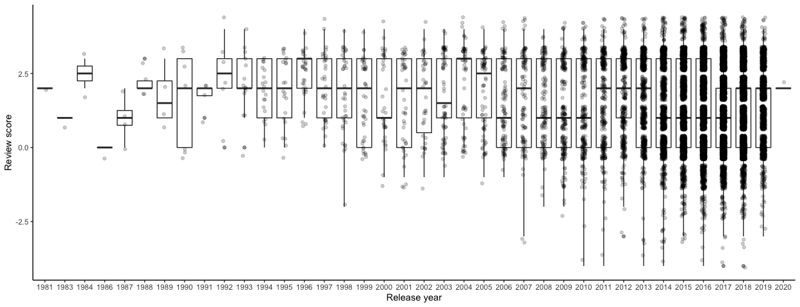

Mini Data Analysis Milestone 3
================
Erick Navarro
26/10/2021

## Introduction

In the previous milestones I explored the datasets contained in the `datateachr` package and, at the end of the milestone 1, I chose to work with the `steam_games()` dataset.

In milestone 2, I summarized some variables contained in that dataset, and formulated two final research questions to focus on, which are the following:

1.  *Do recent released games have better reviews than the older ones?*
2.  *Are the most popular games the ones with the best overall review?*

This is the last milestone of the Mini Data Analysis project. Its objective is to manipulate special data types in R, such as factors and/or dates and times, fitting a model object to your data, and reading and writing data as separate files. The tasks presented here are intended to sharpen some of the results I obtained in the previous stages of the project, in order to reach a deeper conclusions of my research questions.

## Setup

As a first step, I loaded the packages that I was going to use throughout this milestone, as well as the final dataset produced at the end of the Milestone 2

``` r
library(datateachr) 
library(tidyverse)
library(lubridate)
library(here)
library(broom)
steam_games_m3 = readRDS(here("Milestone_2", "steam_games_mda2_final"))
```

## Exercise 1: Special data types

For this exercise, I completed 2 of the 3 tasks specified in the [instructions](https://stat545.stat.ubc.ca/mini-project/mini-project-3/). In the following subsections, I specified which ones I chose and which question I used.

### Task 1

> Task: If your data has some sort of time-based column like a date (but something more granular than just a year):
> - Make a new column that uses a function from the lubridate or tsibble package to modify your original time-based column. (3 points)
> - Then, in a sentence or two, explain how your new column might be useful in exploring a research question. (1 point for demonstrating understanding of the function you used, and 1 point for your justification, which could be subtle or speculative).

> Question: *Do recent released games have better reviews than the older ones?*

For this task, I was asked to create a new variable from my column `release_date`, which was previosuly converted to a Date data type in milestone 2, modifying the original time-based column. To complete this task, I decided to extract only the year of the release date in a new column. In the previous milestone, I divided the games based on their release date in three categories: old, intermediate and new, using 10 year lapses. However, this could potentially hide some patterns that could be observed by plotting the mean review score of the games in each year. Therefore, investigating the release year of the games could be insightful because that could smoothen my plot and reveal any trend hidden by making groups with a high time interval.

``` r
task_1.1 =(steam_games_m3 %>% 
             mutate(release_year = factor(year(release_date)))
)
```

To check that the new variable in the table corresponded to the year, I checked the first observations.

``` r
task_1.1 %>% 
  head() %>% 
  knitr::kable(format = "markdown")
```

<table>
<colgroup>
<col width="1%" />
<col width="18%" />
<col width="5%" />
<col width="9%" />
<col width="36%" />
<col width="9%" />
<col width="8%" />
<col width="5%" />
<col width="5%" />
</colgroup>
<thead>
<tr class="header">
<th align="right">id</th>
<th align="left">name</th>
<th align="left">release_date</th>
<th align="left">release_date_category</th>
<th align="left">all_reviews</th>
<th align="left">all_reviews_category</th>
<th align="right">all_reviews_number</th>
<th align="right">popularity</th>
<th align="left">release_year</th>
</tr>
</thead>
<tbody>
<tr class="odd">
<td align="right">1</td>
<td align="left">DOOM</td>
<td align="left">2016-05-12</td>
<td align="left">New</td>
<td align="left">Very Positive,(42,550),- 92% of the 42,550 user reviews for this game are positive.</td>
<td align="left">Very Positive</td>
<td align="right">3</td>
<td align="right">42550</td>
<td align="left">2016</td>
</tr>
<tr class="even">
<td align="right">2</td>
<td align="left">PLAYERUNKNOWN'S BATTLEGROUNDS</td>
<td align="left">2017-12-21</td>
<td align="left">New</td>
<td align="left">Mixed,(836,608),- 49% of the 836,608 user reviews for this game are positive.</td>
<td align="left">Mixed</td>
<td align="right">0</td>
<td align="right">836608</td>
<td align="left">2017</td>
</tr>
<tr class="odd">
<td align="right">3</td>
<td align="left">BATTLETECH</td>
<td align="left">2018-04-24</td>
<td align="left">New</td>
<td align="left">Mostly Positive,(7,030),- 71% of the 7,030 user reviews for this game are positive.</td>
<td align="left">Mostly Positive</td>
<td align="right">1</td>
<td align="right">7030</td>
<td align="left">2018</td>
</tr>
<tr class="even">
<td align="right">4</td>
<td align="left">DayZ</td>
<td align="left">2018-12-13</td>
<td align="left">New</td>
<td align="left">Mixed,(167,115),- 61% of the 167,115 user reviews for this game are positive.</td>
<td align="left">Mixed</td>
<td align="right">0</td>
<td align="right">167115</td>
<td align="left">2018</td>
</tr>
<tr class="odd">
<td align="right">5</td>
<td align="left">EVE Online</td>
<td align="left">2003-05-06</td>
<td align="left">Intermediate</td>
<td align="left">Mostly Positive,(11,481),- 74% of the 11,481 user reviews for this game are positive.</td>
<td align="left">Mostly Positive</td>
<td align="right">1</td>
<td align="right">11481</td>
<td align="left">2003</td>
</tr>
<tr class="even">
<td align="right">6</td>
<td align="left">Grand Theft Auto V: Premium Online Edition</td>
<td align="left">NA</td>
<td align="left">NA</td>
<td align="left">NaN</td>
<td align="left">NaN</td>
<td align="right">NA</td>
<td align="right">NaN</td>
<td align="left">NA</td>
</tr>
</tbody>
</table>

Finally, I made the new plot using the release year of each game.

``` r
task_1.1 %>% 
  filter(!is.na(release_year),
         !is.na(all_reviews_number)) %>% 
  ggplot(aes(x = release_year, y = all_reviews_number))+
  geom_boxplot(alpha = 0.5) +
  geom_jitter(alpha = 0.2, width = 0.1) +
  theme_classic()+
  xlab("Release year") + 
  ylab("Review score")
```



This plot could me more informative than the one I did previously, which I attach here just as a comparison:

``` r
steam_games_m3 %>% 
  filter(!is.na(all_reviews_number), #Remove the games with no review category
         !is.na(release_date_category)) %>% #Remove the games with an inconsistent datetime element
  ggplot(aes(x = release_date_category, y = all_reviews_number, fill = release_date_category)) +
  geom_boxplot(alpha = 0.5) + 
  geom_jitter(alpha = 0.15, width = 0.1)+ 
  stat_summary(fun = mean, colour = "white")+ #Add the mean as a white dot in the barplot
  theme_classic() + 
  ylab("Review score")+ #Change the y lab 
  xlab("Release date") +
  guides(fill="none") #Remove the fill legends (non necessary)
```


### Task 2

> Task: Produce a new plot that groups some factor levels together into an “other” category (or something similar), using the forcats package (3 points). Then, in a sentence or two, briefly explain why you chose this grouping (1 point here for demonstrating understanding of the grouping, and 1 point for demonstrating some justification for the grouping, which could be subtle or speculative.)

> Question: *Are the most popular games the ones with the best overall review?*

This task asked me to modify a plot that was previously produced in Milestone 2, which involved plotting across at least three groups. For the reader's convenience, said plot was recreated here:

``` r
#Recreating the plot of Milestone 2's task 1.2Q1
steam_games_m3 %>% 
  filter(!is.na(popularity), #Remove the games that have NA in the number of reviews
         all_reviews_category %in% (steam_games_m3$all_reviews_category %>% 
                                      table() %>% 
                                      names())[1:9]) %>% #Remove the games that did not have enough reviews to have an overall review (discussed in Q1 - Extract categories) 
  ggplot(aes(x = all_reviews_category, y = popularity, fill = all_reviews_category))+
  geom_violin( alpha = 0.5) +
  geom_boxplot(width= 0.1, alpha = 0.3) +
  stat_summary(fun = mean, colour = "black", shape = 8)+
  scale_y_log10(label = scales::label_dollar(prefix = "")) +
  ylab("Game popularity")+
  xlab("Overall review")+
  guides(fill = "none")  +
  theme_classic()
```


To complete the task, I decided to modify the number of categories that are presented in said plot, which were too many (Overwhelmingly Positive, Very Positive, Positive, Mostly Positive, Mixed, Mostly Negative, Negative, Very Negative and Overwhelmingly Negative)

Besides being potentially confusing to have a high number of catefories, some of them tend to have overlaping ranges of positive/negative reviews. For example, the Overwhelmingly Positive category tends to be assigned to games with 95-100% of positive reviews, while Very Positive to games with 80-97%. Additionally, some games with the category Positive, which is in a lower rank of "positiveness" have 100% positive reviews, as you can see in this example:

``` r
steam_games_m3 %>% 
  filter(id == "42") %>% 
  knitr::kable(format = "markdown")
```

<table>
<colgroup>
<col width="2%" />
<col width="15%" />
<col width="7%" />
<col width="11%" />
<col width="36%" />
<col width="11%" />
<col width="10%" />
<col width="6%" />
</colgroup>
<thead>
<tr class="header">
<th align="right">id</th>
<th align="left">name</th>
<th align="left">release_date</th>
<th align="left">release_date_category</th>
<th align="left">all_reviews</th>
<th align="left">all_reviews_category</th>
<th align="right">all_reviews_number</th>
<th align="right">popularity</th>
</tr>
</thead>
<tbody>
<tr class="odd">
<td align="right">42</td>
<td align="left">GOD WARS The Complete Legend</td>
<td align="left">2019-06-13</td>
<td align="left">New</td>
<td align="left">Positive,(11),- 100% of the 11 user reviews for this game are positive.</td>
<td align="left">Positive</td>
<td align="right">2</td>
<td align="right">11</td>
</tr>
</tbody>
</table>

As it can be observed, the game review categorization seems to be quite subjective in the different levels of positiveness and negativeness; the previous example is just one of the many cases where a game has a percentage of positive or negative reviews that is in the range of more than 1 category. Therefore, I decided to colapse some levels as following:

-   Positive: comprising the original categories Overwhelmingly Positive, Very Positive, Positive and Mostly Positive
-   Mixed: comprising the original category Mixed
-   Negative: comprising the original categories Overwhelmingly Negative, Very Negative, Negative and Mostly Negative

After grouping the redundant factor levels together, I plotted again with the reduced number of categories.

``` r
#grouping some factor levels together into an "other" category
task_1.2 = (steam_games_m3 %>% 
              mutate(all_reviews_category = fct_collapse(all_reviews_category,
                                                         Positive = c("Overwhelmingly Positive", "Very Positive", "Positive" , "Mostly Positive"),
                                                         Mixed = "Mixed",
                                                         Negative = c("Overwhelmingly Negative", "Very Negative", "Negative" , "Mostly Negative"),
                                                         other_level = "Undetermined" ))
)

#Plot again with the new collapsed categories
task_1.2 %>% 
  filter(!is.na(popularity), #Remove the games that have NA in the number of reviews
         all_reviews_category != "Undetermined") %>% #Remove the games that did not have enough reviews to have an overall review (discussed in Q1 - Extract categories) 
  ggplot(aes(x = all_reviews_category, y = popularity, fill = all_reviews_category))+
  geom_violin( alpha = 0.5) +
  geom_boxplot(width= 0.1, alpha = 0.3) +
  stat_summary(fun = mean, colour = "black", shape = 8)+
  scale_y_log10(label = scales::label_dollar(prefix = "")) +
  ylab("Game popularity")+
  xlab("Overall review")+
  guides(fill = "none")  +
  theme_classic()
```


## Exercise 2: Modelling

For this exercise, I picked the **research question** *Are the most popular games the ones with the best overall review?*, where the \*variable of interest\*\* is game popularity.

## 2.1 Fit a model (5 points)

For this research question, I decided to test the mean game popularity across all of the different categories using ANOVA.

``` r
anova_res = (steam_games_m3 %>% 
               filter(!is.na(popularity),
                      all_reviews_category %in% (steam_games_m3$all_reviews_category %>% 
                                      table() %>% 
                                      names())[1:9]) %>%#Remove the games that did not have enough reviews to have an overall review (discussed in Milestone 2 Q1 - Extract categories)
               droplevels() %>% 
               aov(formula = popularity ~ all_reviews_category, data = .)
               )

tidy(anova_res) %>% knitr::kable(format = "markdown")
```

| term                   |     df|         sumsq|      meansq|  statistic|  p.value|
|:-----------------------|------:|-------------:|-----------:|----------:|--------:|
| all\_reviews\_category |      8|  5.643930e+10|  7054912357|   54.20005|        0|
| Residuals              |  17352|  2.258611e+12|   130164323|         NA|       NA|

## 2.2 Producing something relevant(5 points)

After doing the statistical test, I chose to display the p-value, which is a relevant statistical result from the ANOVA.

``` r
anova_res %>% 
  broom::tidy() %>% 
  filter(term == "all_reviews_category") %>% 
  pull(p.value)
```

    ## [1] 1.607791e-87

# Exercise 3: Reading and writing data

## 3.1 (5 points)

For this task, I had to take a summary table produced in Milestone 2 (exercise 1.2), and write it as a csv file in the `output` folder.

I chose to save the summary table of question 3 (*Are the most popular games the ones with the best overall review?*), which is the one I chose at the end to conduct the statistical test.

``` r
summ_table_rev_pop = (steam_games_m3 %>% 
  filter(!is.na(popularity), #Remove the games that have NA or NaN in the number of reviews column
         all_reviews_category %in% (steam_games_m3$all_reviews_category %>% 
                                      table() %>% 
                                      names())[1:9]) %>% #Remove the games that did not have enough reviews to have an overall review (discussed in Q1 - Extract categories)
  group_by(all_reviews_category) %>% 
  summarise(mean_pop = mean(popularity), #Compute the summary statistics
            std_pop = sd(popularity),
            median_pop = median(popularity),
            min_pop = min(popularity),
            max_pop = max(popularity)))

summ_table_rev_pop%>% 
  knitr::kable(format = "markdown")
```

| all\_reviews\_category  |    mean\_pop|     std\_pop|  median\_pop|  min\_pop|  max\_pop|
|:------------------------|------------:|------------:|------------:|---------:|---------:|
| Overwhelmingly Positive |  12966.71340|  31030.43172|         2413|       500|    310394|
| Very Positive           |   2319.68437|  13665.27086|          279|        50|    553458|
| Positive                |     23.11771|     10.91703|           20|        10|        49|
| Mostly Positive         |   1112.16490|   8761.78135|           82|        10|    407706|
| Mixed                   |    846.76795|  13464.48441|           49|        10|    836608|
| Mostly Negative         |    232.24297|   1164.27441|           31|        10|     22589|
| Negative                |     19.33333|     10.12607|           15|        10|        49|
| Very Negative           |    148.02703|    111.80476|          107|        51|       483|
| Overwhelmingly Negative |   1426.85714|    925.46915|         1096|       509|      3057|

After producing the table, I saved it as a .csv file.

``` r
write_csv(summ_table_rev_pop, file = here::here("output","summary_reviews_popularity.csv"))
```

## 3.2 (5 points)

For this task, I had to write my model object obtained from Exercise 2 to an RDS file, and load it again.

### Save the model

``` r
saveRDS(object = anova_res, file = here::here("output","anova_results.rds"))
```

### Reload the model

``` r
anova_res_reloaded = readRDS(here::here("output","anova_results.rds"))

anova_res_reloaded %>% 
  tidy() %>% 
  knitr::kable(format = "markdown") #Check that it was reloaded correctly
```

| term                   |     df|         sumsq|      meansq|  statistic|  p.value|
|:-----------------------|------:|-------------:|-----------:|----------:|--------:|
| all\_reviews\_category |      8|  5.643930e+10|  7054912357|   54.20005|        0|
| Residuals              |  17352|  2.258611e+12|   130164323|         NA|       NA|
