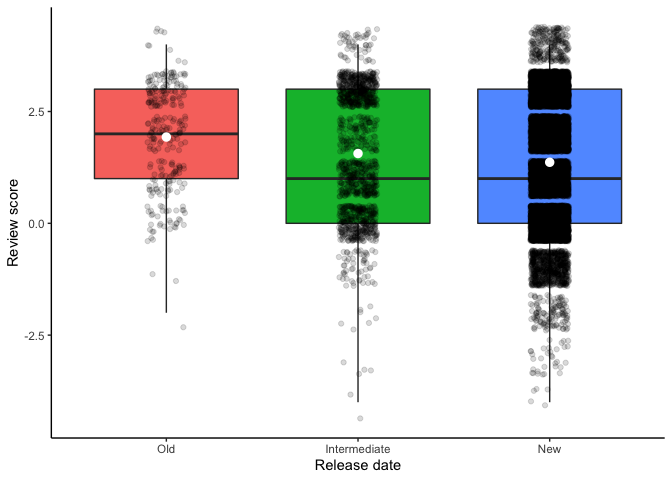
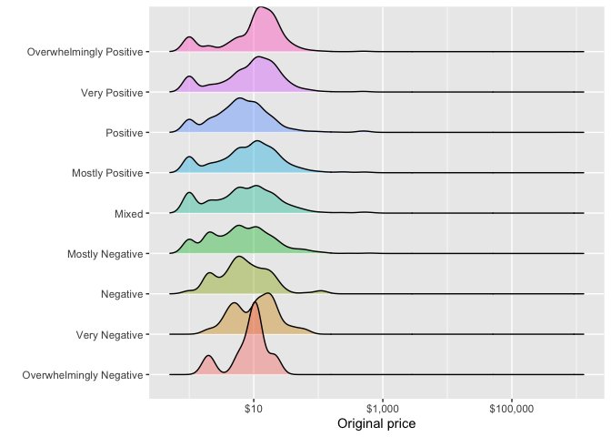
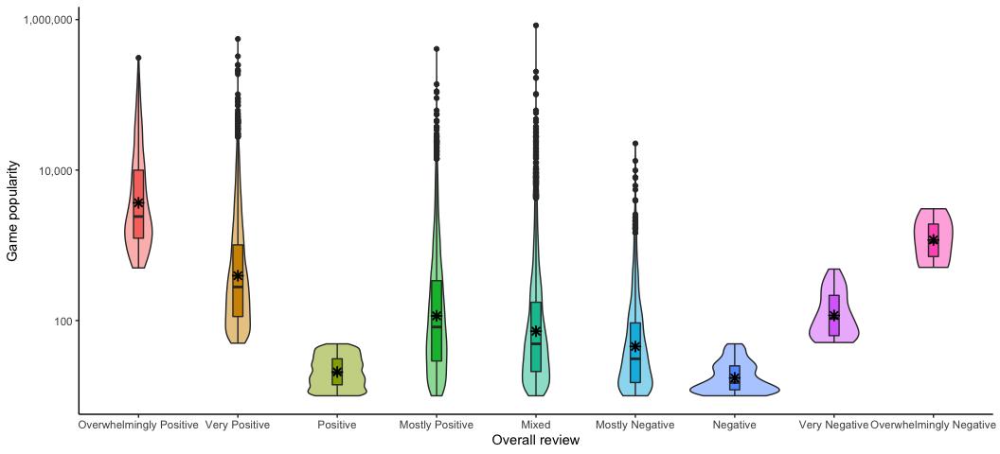

Mini Data Analysis Milestone 2
================
Erick Navarro
17/10/2021

The objective of this assignment is to explore the concept of tidy data and investigate further my research questions.

The first step will be loading the data and and the packages that will be used:

``` r
library(datateachr) #This package contains the dataset steam_games, which is the one that I will use for this milestone
library(tidyverse)
library(lubridate)
library(knitr)
library(scales)
library(forcats)
library(ggridges)
```

# Task 1: Process and summarize the data (15 points)

### 1.1 Research questions (2.5 points)

To guide the direction of this assignment, I will specify the 4 research questions that were defined in my milestone 1, which are the following:

1.  *Do recent released games have better reviews than the older ones?*
2.  *Are games with better reviews the most expensive ones?*
3.  *Are the most popular games (i.e. games with more reviews) the ones with the best overall review?*
4.  *Which developer produces the most popular games (i.e games with more reviews) or the ones with the best reviews?*

### 1.2 Summarize and graphing (10 points)

For each of the research questions, I chose one summarizing and one graphing task from the ones specified in the [instructions](https://stat545.stat.ubc.ca/mini-project/mini-project-2/). After that, a short line commenting weather it is useful or not to my research question is included.

**Summarizing:**

1.  Compute the *range*, *mean*, and *two other summary statistics* of **one numerical variable** across the groups of **one categorical variable** from your data.
2.  Compute the number of observations for at least one of your categorical variables. Do not use the function `table()`!
3.  Create a categorical variable with 3 or more groups from an existing numerical variable. You can use this new variable in the other tasks! *An example: age in years into "child, teen, adult, senior".*
4.  Based on two categorical variables, calculate two summary statistics of your choosing.

**Graphing:**

1.  Create a graph out of summarized variables that has at least two geom layers.
2.  Create a graph of your choosing, make one of the axes logarithmic, and format the axes labels so that they are "pretty" or easier to read.
3.  Make a graph where it makes sense to customize the alpha transparency.
4.  Create 3 histograms out of summarized variables, with each histogram having different sized bins. Pick the "best" one and explain why it is the best.

Make sure it's clear what research question you are doing each operation for!

#### Q1: Do recent released games have better reviews than the older ones?

> **Summarizing task**: Create a categorical variable with 3 or more groups from an existing numerical variable.

To explore the reviews in games that were released in different time lapses, I decided to create 3 categories for the dataset, depending on their release date: 1. New (after 2011 to the present) 2. Intermediate (from 2001 to 2011) 3. Old (before 2001)

``` r
#Code chunk to create the three categories described above

#First, I check the format of the release date
head(steam_games$release_date)
```

    ## [1] "May 12, 2016" "Dec 21, 2017" "Apr 24, 2018" "Dec 13, 2018" "May 6, 2003" 
    ## [6] "NaN"

``` r
class(steam_games$release_date) 
```

    ## [1] "character"

``` r
#Creating the summarized tibble
steam_games_q1 = (steam_games %>%
                    mutate(release_date = mdy(release_date)) %>% #Use the mdy() lubridate function to change the data type from character to date
                    mutate(release_date_category = case_when( release_date > dmy("01-01-2012") ~ "New",
                                                             (dmy("31-12-2011") > release_date & release_date > dmy("01-01-2001")) ~ "Intermediate",
                                                             release_date < dmy("31-12-2000") ~ "Old")) %>%
                    mutate(release_date_category = as.factor(release_date_category)) %>% #Convert the categories to a factor
                    mutate(release_date_category = fct_relevel(release_date_category, "Old", "Intermediate")) #Relevel the factors (will be useful for plotting later)
                    )

#NOTE: The format of release_date was heterogeneous in some games; it included elements such as "¯\\_(ツ)_/¯", "(When) I'm ready!", or just the year. Those games (4418/40833) failed to parse.

#Explore the number of games we have in each category
table(steam_games_q1$release_date_category) %>% knitr::kable(format = "markdown", col.names = c("Category", "Frequency"))
```

| Category     |  Frequency|
|:-------------|----------:|
| Old          |        321|
| Intermediate |       1749|
| New          |      34339|

> **Graphing task**: Create a graph out of summarized variables that has at least two geom layers & Make a graph where it makes sense to customize the alpha transparency.

Now, after creating the summarized variables, I decided to plot the reviews distribution for each category (new, intermediate and old). I will divide this task in 3 steps: extracting the reviews, converting them to a numerical value, and plotting the results.

*1. Extract the reviews*

As a first step, I will convert extract the reviews and create a new column that stores them

``` r
#Code chunk to create a vairable with the reviews, and convert them to a numerical value that can be plotted

steam_games_q1 = (steam_games_q1 %>%
                    bind_cols(., #Bind a new column to the original dataset
                              (str_split(steam_games_q1$all_reviews, pattern = ",", simplify = TRUE) %>% #separate the content of all_reviews using commas
                                 as_tibble()%>% #Convert the matrix output to a tibble
                                 select(V1)) %>% #Select only the first column that stores the category of the overall review
                                rename( all_reviews_category= V1)) %>%  #Rename the variable to a more informative name
                    mutate(all_reviews_category = factor(all_reviews_category)) #Make the categories a factor 
                  ) 
```

Then, I will explore the frequencies of the review categories to decide which number I will assign to each category

``` r
table(steam_games_q1$all_reviews_category) %>% knitr::kable(format = "markdown", col.names = c("Category", "Frequency"))
```

| Category                |  Frequency|
|:------------------------|----------:|
| 1 user reviews          |       3023|
| 2 user reviews          |       1926|
| 3 user reviews          |       1469|
| 4 user reviews          |       1082|
| 5 user reviews          |        948|
| 6 user reviews          |        838|
| 7 user reviews          |        693|
| 8 user reviews          |        600|
| 9 user reviews          |        528|
| Mixed                   |       4680|
| Mostly Negative         |        782|
| Mostly Positive         |       3311|
| NaN                     |       2810|
| Negative                |        135|
| Overwhelmingly Negative |          7|
| Overwhelmingly Positive |        321|
| Positive                |       3551|
| Very Negative           |         37|
| Very Positive           |       4539|

Finally, I will reorder the factors according to the correct order of categories, which is going to be useful in the future in case I want to plot.

``` r
steam_games_q1 = (steam_games_q1 %>% mutate(all_reviews_category = fct_relevel(all_reviews_category, "Overwhelmingly Positive",
                                                                        "Very Positive",
                                                                        "Positive",
                                                                        "Mostly Positive",
                                                                        "Mixed", 
                                                                        "Mostly Negative",
                                                                        "Negative",
                                                                        "Very Negative",
                                                                        "Overwhelmingly Negative")))
```

*2. Convert the review categories to a numerical value*

As it can be seen in the previous part, there are several games that have no review category because the number of reviews they have is very small (1-9); those games will be filtered out of the plot. After looking at the table, I decided to assign the following numerical value to the categories:

-   Overwhelmingly Positive: 4
-   Very Positive: 3
-   Positive: 2
-   Mostly positive: 1
-   Mixed: 0
-   Mostly Negative: -1
-   Negative: -2
-   Very Negative: -3
-   Overwhelmingly Negative: -4

``` r
#Assign a number to each category in a new column
steam_games_q1 = (steam_games_q1 %>%
                    mutate(all_reviews_number = case_when(all_reviews_category == "Overwhelmingly Positive" ~ 4,
                                                          all_reviews_category == "Very Positive" ~ 3,
                                                          all_reviews_category == "Positive" ~ 2,
                                                          all_reviews_category == "Mostly Positive" ~ 1,
                                                          all_reviews_category == "Mixed" ~ 0,
                                                          all_reviews_category == "Mostly Negative" ~ -1,
                                                          all_reviews_category == "Negative" ~ -2,
                                                          all_reviews_category == "Very Negative" ~ -3,
                                                          all_reviews_category == "Overwhelmingly Negative" ~ -4
                                                          )))

#To check that the output tibble is correct, we look at the first entries
steam_games_q1 %>% 
  select(id, all_reviews, all_reviews_category,all_reviews_number) %>%
  head() %>% 
  knitr::kable(format = "markdown")
```

<table style="width:100%;">
<colgroup>
<col width="3%" />
<col width="65%" />
<col width="16%" />
<col width="15%" />
</colgroup>
<thead>
<tr class="header">
<th align="right">id</th>
<th align="left">all_reviews</th>
<th align="left">all_reviews_category</th>
<th align="right">all_reviews_number</th>
</tr>
</thead>
<tbody>
<tr class="odd">
<td align="right">1</td>
<td align="left">Very Positive,(42,550),- 92% of the 42,550 user reviews for this game are positive.</td>
<td align="left">Very Positive</td>
<td align="right">3</td>
</tr>
<tr class="even">
<td align="right">2</td>
<td align="left">Mixed,(836,608),- 49% of the 836,608 user reviews for this game are positive.</td>
<td align="left">Mixed</td>
<td align="right">0</td>
</tr>
<tr class="odd">
<td align="right">3</td>
<td align="left">Mostly Positive,(7,030),- 71% of the 7,030 user reviews for this game are positive.</td>
<td align="left">Mostly Positive</td>
<td align="right">1</td>
</tr>
<tr class="even">
<td align="right">4</td>
<td align="left">Mixed,(167,115),- 61% of the 167,115 user reviews for this game are positive.</td>
<td align="left">Mixed</td>
<td align="right">0</td>
</tr>
<tr class="odd">
<td align="right">5</td>
<td align="left">Mostly Positive,(11,481),- 74% of the 11,481 user reviews for this game are positive.</td>
<td align="left">Mostly Positive</td>
<td align="right">1</td>
</tr>
<tr class="even">
<td align="right">6</td>
<td align="left">NaN</td>
<td align="left">NaN</td>
<td align="right">NA</td>
</tr>
</tbody>
</table>

*3.Graphing*

Now that the tibble is correct for graphing and the reviews were converted to a numerical value, we can do the plot and observe the differences between all of the categories.

``` r
steam_games_q1 %>% 
  filter(!is.na(all_reviews_number), #Remove the games with no review category
         !is.na(release_date_category)) %>% #Remove the games with an inconsistent datetime element
  ggplot(aes(x = release_date_category, y = all_reviews_number, fill = release_date_category)) +
  geom_boxplot() + 
  geom_jitter(alpha = 0.15, width = 0.1)+ 
  stat_summary(fun = mean, colour = "white")+ #Add the mean as a white dot in the barplot
  theme_classic() + 
  ylab("Review score")+ #Change the y lab 
  xlab("Release date") +
  guides(fill="none") #Remove the fill legends (non necessary)
```



This task was helpful to answer my question (*Do recent released games have better reviews than the older ones?*) because, by dividing the games acoording to their release date in periods of 10 years, I could observe that there is a trend in old games to have better overall reviews than intermediate and new ones (which was contrary to what I was expecting). However, a further statistical analysis is needed to make a conclusion.

#### Q2: Are games with better reviews the most expensive ones?

> Summarizing task: Compute the *range*, *mean*, and *two other summary statistics* of **one numerical variable** across the groups of **one categorical variable** from your data.\*

For this research question, I calculated the summary statistics of the price per review category, to explore the distribution of prices. Since I needed a column that contains the review category of each game, which was already done in the previous question, I used `steam_games_q1` as my starting dataset.

``` r
steam_games_q1 %>% 
  filter(!is.na(original_price), #Remove the games that have NA in the original price
         all_reviews_category %in% (steam_games_q1$all_reviews_category %>% 
                                      table() %>% 
                                      names())[1:9]) %>% #Remove the games that did not have enough reviews to have an overall review (discussed in Q1 - Extract vategories)
  group_by(all_reviews_category) %>% 
  summarise(mean_price = mean(original_price), #Compute the summary statistics
            std_price = sd(original_price),
            median_price = median(original_price),
            min_price = min(original_price),
            max_price = max(original_price)) %>% 
  knitr::kable(format = "markdown")
```

| all\_reviews\_category  |  mean\_price|    std\_price|  median\_price|  min\_price|  max\_price|
|:------------------------|------------:|-------------:|--------------:|-----------:|-----------:|
| Overwhelmingly Positive |    14.886226|     30.185184|           9.99|        0.00|      501.87|
| Very Positive           |    15.014226|     35.954507|           9.99|        0.00|      501.87|
| Positive                |   201.936467|  11061.335331|           4.99|        0.00|   650560.00|
| Mostly Positive         |    16.436775|     45.270922|           8.99|        0.00|      624.74|
| Mixed                   |    16.025741|     51.907027|           5.99|        0.00|      624.74|
| Mostly Negative         |    12.190993|     36.675383|           4.99|        0.00|      624.74|
| Negative                |    10.335985|     17.196160|           4.99|        0.00|      110.61|
| Very Negative           |    13.148387|     12.300908|           9.99|        0.99|       59.99|
| Overwhelmingly Negative |     9.132857|      5.843189|           9.99|        0.99|       19.99|

> Plotting task: Create a graph of your choosing, make one of the axes logarithmic, and format the axes labels so that they are "pretty" or easier to read

To have a visual representation of the distribution of the variable that was summarized above (price) in each category and compare them, I decided to use the function `geom_density_ridges()`

``` r
steam_games_q1 %>% 
  filter(!is.na(original_price), #Remove the games that have NA in the original price
         all_reviews_category %in% (steam_games_q1$all_reviews_category %>% 
                                      table() %>% 
                                      names())[1:9]) %>% #Remove the games that did not have enough reviews to have an overall review (discussed in Q1 - Extract categories) 
  mutate(original_price = original_price + 1 ,
         all_reviews_category = fct_rev(all_reviews_category)) %>% #Add 1 to the price to avoid infinite values when applying the log10 transformation
  ggplot(aes(original_price, all_reviews_category))+
  ggridges::geom_density_ridges(aes(fill = all_reviews_category), alpha = 0.4) +
  scale_x_log10(labels = scales::label_dollar())+ #Add a log10 scale to the x axis
  scale_y_discrete("")+ #Remove the y axis title (non necessary)
  xlab("Original price")+
  guides(fill = "none") 
```



This task provided information that helped me to explore my question. By looking at the density of each group, I can see that, overall, they all have a very similar distribution around similar prices. There are some categories, such as Overwhelmingly Negative, that have a slightly different shape, and a strong peak. I wonder if those differences are enough for its prices to be statistically different compared to any of the other categories when doing a proper statistical test.

#### Q3: Are the most popular games (i.e. games with more reviews) the ones with the best overall review?

> Summarizing task: Compute the *range*, *mean*, and *two other summary statistics* of **one numerical variable** across the groups of **one categorical variable** from your data

I decided to calculate the summary statistics of the number of reviews per each review category. Exploring the distribution of the number of reviews per category, which I will use as a proxy of popularity, can help me to answer this research question.

Since I needed a column that contains the review category of each game, which was already done in the research question 1, I used `steam_games_q1` as my starting point here.

The first step then, was to extract the number of reviews per game, which was embedded in the column all\_reviews, as it can be observed here:

``` r
head(steam_games_q1$all_reviews)
```

    ## [1] "Very Positive,(42,550),- 92% of the 42,550 user reviews for this game are positive."  
    ## [2] "Mixed,(836,608),- 49% of the 836,608 user reviews for this game are positive."        
    ## [3] "Mostly Positive,(7,030),- 71% of the 7,030 user reviews for this game are positive."  
    ## [4] "Mixed,(167,115),- 61% of the 167,115 user reviews for this game are positive."        
    ## [5] "Mostly Positive,(11,481),- 74% of the 11,481 user reviews for this game are positive."
    ## [6] "NaN"

To get the number of reviews it and make it a new independent column, I could not use the same approach as the one used in question 1 to extract the review categories, because the numeric values inside the brackets are separated by commas, so using said element to separate columns would lead to the review number being split. Therefore, I had to extract the element inside the brackets, and then coerce it into a numeric type.

``` r
steam_games_q1 = (steam_games_q1 %>%
                    mutate(popularity = sub(").*", "",all_reviews),#Create a new column removing all of the characters after the ")" bracket in all_reviews
                           popularity = sub(".*\\(","", popularity), #Remove all of the characters before the "(" bracket of the popularity column
                           popularity = sub(",","", popularity),  #Eliminate the commas that separate the numbers so that I can coerce them to numeric
                           popularity = as.numeric(popularity)) #Coerce the values to numeric
                  ) 

#Check that the final tibble is correct
steam_games_q1 %>% 
  select(id, all_reviews, popularity) %>% 
  head() %>% 
  knitr::kable(format = "markdown")
```

<table style="width:100%;">
<colgroup>
<col width="3%" />
<col width="84%" />
<col width="11%" />
</colgroup>
<thead>
<tr class="header">
<th align="right">id</th>
<th align="left">all_reviews</th>
<th align="right">popularity</th>
</tr>
</thead>
<tbody>
<tr class="odd">
<td align="right">1</td>
<td align="left">Very Positive,(42,550),- 92% of the 42,550 user reviews for this game are positive.</td>
<td align="right">42550</td>
</tr>
<tr class="even">
<td align="right">2</td>
<td align="left">Mixed,(836,608),- 49% of the 836,608 user reviews for this game are positive.</td>
<td align="right">836608</td>
</tr>
<tr class="odd">
<td align="right">3</td>
<td align="left">Mostly Positive,(7,030),- 71% of the 7,030 user reviews for this game are positive.</td>
<td align="right">7030</td>
</tr>
<tr class="even">
<td align="right">4</td>
<td align="left">Mixed,(167,115),- 61% of the 167,115 user reviews for this game are positive.</td>
<td align="right">167115</td>
</tr>
<tr class="odd">
<td align="right">5</td>
<td align="left">Mostly Positive,(11,481),- 74% of the 11,481 user reviews for this game are positive.</td>
<td align="right">11481</td>
</tr>
<tr class="even">
<td align="right">6</td>
<td align="left">NaN</td>
<td align="right">NaN</td>
</tr>
</tbody>
</table>

After extracting the review numbers, I computed the summary statistics of the number of reviews (popularity) per category

``` r
steam_games_q1 %>% 
  filter(!is.na(popularity), #Remove the games that have NA or NaN in the number of reviews column
         all_reviews_category %in% (steam_games_q1$all_reviews_category %>% 
                                      table() %>% 
                                      names())[1:9]) %>% #Remove the games that did not have enough reviews to have an overall review (discussed in Q1 - Extract categories)
  group_by(all_reviews_category) %>% 
  summarise(mean_reviews = mean(popularity), #Compute the summary statistics
            std_reviews = sd(popularity),
            median_reviews = median(popularity),
            min_reviews = min(popularity),
            max_reviews = max(popularity)) %>% 
  knitr::kable(format = "markdown")
```

<table>
<colgroup>
<col width="26%" />
<col width="14%" />
<col width="13%" />
<col width="17%" />
<col width="13%" />
<col width="13%" />
</colgroup>
<thead>
<tr class="header">
<th align="left">all_reviews_category</th>
<th align="right">mean_reviews</th>
<th align="right">std_reviews</th>
<th align="right">median_reviews</th>
<th align="right">min_reviews</th>
<th align="right">max_reviews</th>
</tr>
</thead>
<tbody>
<tr class="odd">
<td align="left">Overwhelmingly Positive</td>
<td align="right">12966.71340</td>
<td align="right">31030.43172</td>
<td align="right">2413</td>
<td align="right">500</td>
<td align="right">310394</td>
</tr>
<tr class="even">
<td align="left">Very Positive</td>
<td align="right">2319.68437</td>
<td align="right">13665.27086</td>
<td align="right">279</td>
<td align="right">50</td>
<td align="right">553458</td>
</tr>
<tr class="odd">
<td align="left">Positive</td>
<td align="right">23.11771</td>
<td align="right">10.91703</td>
<td align="right">20</td>
<td align="right">10</td>
<td align="right">49</td>
</tr>
<tr class="even">
<td align="left">Mostly Positive</td>
<td align="right">1112.16490</td>
<td align="right">8761.78135</td>
<td align="right">82</td>
<td align="right">10</td>
<td align="right">407706</td>
</tr>
<tr class="odd">
<td align="left">Mixed</td>
<td align="right">846.76795</td>
<td align="right">13464.48441</td>
<td align="right">49</td>
<td align="right">10</td>
<td align="right">836608</td>
</tr>
<tr class="even">
<td align="left">Mostly Negative</td>
<td align="right">232.24297</td>
<td align="right">1164.27441</td>
<td align="right">31</td>
<td align="right">10</td>
<td align="right">22589</td>
</tr>
<tr class="odd">
<td align="left">Negative</td>
<td align="right">19.33333</td>
<td align="right">10.12607</td>
<td align="right">15</td>
<td align="right">10</td>
<td align="right">49</td>
</tr>
<tr class="even">
<td align="left">Very Negative</td>
<td align="right">148.02703</td>
<td align="right">111.80476</td>
<td align="right">107</td>
<td align="right">51</td>
<td align="right">483</td>
</tr>
<tr class="odd">
<td align="left">Overwhelmingly Negative</td>
<td align="right">1426.85714</td>
<td align="right">925.46915</td>
<td align="right">1096</td>
<td align="right">509</td>
<td align="right">3057</td>
</tr>
</tbody>
</table>

> Graphing task: Create a graph out of summarized variables that has at least two geom layers & Create a graph of your choosing, make one of the axes logarithmic, and format the axes labels so that they are "pretty" or easier to read.

Finally, I plotted the popularity distribution of the games per category, marking the mean as an asterisk.

``` r
steam_games_q1 %>% 
  filter(!is.na(popularity), #Remove the games that have NA in the number of reviews
         all_reviews_category %in% (steam_games_q1$all_reviews_category %>% 
                                      table() %>% 
                                      names())[1:9]) %>% #Remove the games that did not have enough reviews to have an overall review (discussed in Q1 - Extract categories) 
  ggplot(aes(x = all_reviews_category, y = popularity, fill = all_reviews_category))+
  geom_violin( alpha = 0.5) +
  geom_boxplot(width= 0.1, alpha = 0.3) +
  stat_summary(fun = mean, colour = "black", shape = 8)+
  scale_y_log10(label = scales::label_dollar(prefix = "")) +
  ylab("Game popularity")+
  xlab("Overall review")+
  guides(fill = "none")  +
  theme_classic()
```



With these tasks, I could see that there is a difference in the popularity distribution of the games across different categories. Games with positive and negative reviews tend to be less popular than games with overwhelmingly positive or overwhelmingly negative results. I would be interested in doing a statistical test to evaluate each category and know which ones are statistically significantly different from others. For what I can see here, probably more than 2 categories could be different to at least 2 other groups.

#### Q4: Which developer produces the most popular games (i.e games with more reviews)?

> Summarizing task: Compute the *range*, *mean*, and *two other summary statistics* of **one numerical variable** across the groups of **one categorical variable** from your data & Compute the number of observations for at least one of your categorical variables

For this research question, I needed the popularity numbers of each game, which was obtained in the previous section (Q3). Therefore, I used `steam_games_q1` again as my starting point. Then, I computed the summary statistics of the popularity measure (number of reviews) across the different developers, as well as the number of games that each developer has.

*1. Summary statistics of popularity per developer*

``` r
steam_games_q1 %>% 
  filter(!is.na(popularity), #Remove the games that have NA or NaN in the number of reviews column
         all_reviews_category %in% (steam_games_q1$all_reviews_category %>% 
                                      table() %>% 
                                      names())[1:9]) %>% #Remove the games that did not have enough reviews to have an overall review (discussed in Q1 - Extract categories)
  group_by(all_reviews_category) %>% 
  summarise(mean_reviews = mean(popularity), #Compute the summary statistics
            std_reviews = sd(popularity),
            median_reviews = median(popularity),
            min_reviews = min(popularity),
            max_reviews = max(popularity)) %>% 
  knitr::kable(format = "markdown")
```

<table>
<colgroup>
<col width="26%" />
<col width="14%" />
<col width="13%" />
<col width="17%" />
<col width="13%" />
<col width="13%" />
</colgroup>
<thead>
<tr class="header">
<th align="left">all_reviews_category</th>
<th align="right">mean_reviews</th>
<th align="right">std_reviews</th>
<th align="right">median_reviews</th>
<th align="right">min_reviews</th>
<th align="right">max_reviews</th>
</tr>
</thead>
<tbody>
<tr class="odd">
<td align="left">Overwhelmingly Positive</td>
<td align="right">12966.71340</td>
<td align="right">31030.43172</td>
<td align="right">2413</td>
<td align="right">500</td>
<td align="right">310394</td>
</tr>
<tr class="even">
<td align="left">Very Positive</td>
<td align="right">2319.68437</td>
<td align="right">13665.27086</td>
<td align="right">279</td>
<td align="right">50</td>
<td align="right">553458</td>
</tr>
<tr class="odd">
<td align="left">Positive</td>
<td align="right">23.11771</td>
<td align="right">10.91703</td>
<td align="right">20</td>
<td align="right">10</td>
<td align="right">49</td>
</tr>
<tr class="even">
<td align="left">Mostly Positive</td>
<td align="right">1112.16490</td>
<td align="right">8761.78135</td>
<td align="right">82</td>
<td align="right">10</td>
<td align="right">407706</td>
</tr>
<tr class="odd">
<td align="left">Mixed</td>
<td align="right">846.76795</td>
<td align="right">13464.48441</td>
<td align="right">49</td>
<td align="right">10</td>
<td align="right">836608</td>
</tr>
<tr class="even">
<td align="left">Mostly Negative</td>
<td align="right">232.24297</td>
<td align="right">1164.27441</td>
<td align="right">31</td>
<td align="right">10</td>
<td align="right">22589</td>
</tr>
<tr class="odd">
<td align="left">Negative</td>
<td align="right">19.33333</td>
<td align="right">10.12607</td>
<td align="right">15</td>
<td align="right">10</td>
<td align="right">49</td>
</tr>
<tr class="even">
<td align="left">Very Negative</td>
<td align="right">148.02703</td>
<td align="right">111.80476</td>
<td align="right">107</td>
<td align="right">51</td>
<td align="right">483</td>
</tr>
<tr class="odd">
<td align="left">Overwhelmingly Negative</td>
<td align="right">1426.85714</td>
<td align="right">925.46915</td>
<td align="right">1096</td>
<td align="right">509</td>
<td align="right">3057</td>
</tr>
</tbody>
</table>

> Graphing task: Create a graph out of summarized variables that has at least two geom layers

Plot the distribution of reviews for each developer. Boxplot + Jitterplot

Do top popularity developers have as well top-reviewed games?

### 1.3 (2.5 points)

Based on the operations that you've completed, how much closer are you to answering your research questions? Think about what aspects of your research questions remain unclear. Can your research questions be refined, now that you've investigated your data a bit more? Which research questions are yielding interesting results?

<!------------------------- Write your answer here ---------------------------->
<!----------------------------------------------------------------------------->
# Task 2: Tidy your data (12.5 points)

In this task, we will do several exercises to reshape our data. The goal here is to understand how to do this reshaping with the `tidyr` package.

A reminder of the definition of *tidy* data:

-   Each row is an **observation**
-   Each column is a **variable**
-   Each cell is a **value**

*Tidy'ing* data is sometimes necessary because it can simplify computation. Other times it can be nice to organize data so that it can be easier to understand when read manually.

### 2.1 (2.5 points)

Based on the definition above, can you identify if your data is tidy or untidy? Go through all your columns, or if you have &gt;8 variables, just pick 8, and explain whether the data is untidy or tidy.

<!--------------------------- Start your work below --------------------------->
<!----------------------------------------------------------------------------->
### 2.2 (5 points)

Now, if your data is tidy, untidy it! Then, tidy it back to it's original state.

If your data is untidy, then tidy it! Then, untidy it back to it's original state.

Be sure to explain your reasoning for this task. Show us the "before" and "after".

<!--------------------------- Start your work below --------------------------->
<!----------------------------------------------------------------------------->
### 2.3 (5 points)

Now, you should be more familiar with your data, and also have made progress in answering your research questions. Based on your interest, and your analyses, pick 2 of the 4 research questions to continue your analysis in milestone 3, and explain your decision.

Try to choose a version of your data that you think will be appropriate to answer these 2 questions in milestone 3. Use between 4 and 8 functions that we've covered so far (i.e. by filtering, cleaning, tidy'ing, dropping irrelvant columns, etc.).

<!--------------------------- Start your work below --------------------------->
<!----------------------------------------------------------------------------->
*When you are done, knit an `md` file. This is what we will mark! Make sure to open it and check that everything has knitted correctly before submitting your tagged release.*

### Attribution

Thanks to Victor Yuan for mostly putting this together.
